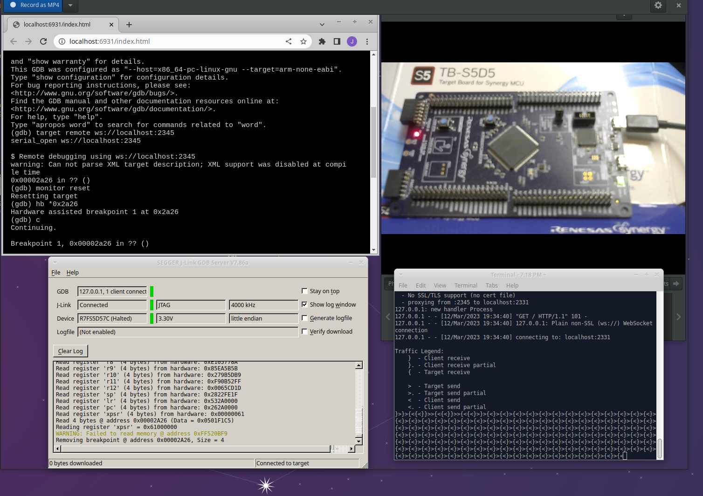

# Running GDB in a webbrowser

This repo contains GDB 7.11 compiled for webassembly targeting Arm targets.

## Running step-by-step

Here are step-by-steps to experiment with gdb built for webassembly and using websockets to connect to GDB server.
Two alternative flows are provided, the first targeting qemu, the second Renesas Synergy TB-S5D5 with a `R7FS5D57C` device and JLink.

1. Clone this repository
2. Build your elf file to the target
  - **qemu**: Create and build your project, https://github.com/idoth2o/arm_bare_boot has a barebones simple example.
  - **Renesas**: Create a Synergy Blinky example project in e2studio
3. Download your elf (hex/bin/etc) to the target. This early demo does not have a filesystem to upload files to yet.
  - **qemu**: This isn't needed for qemu case as starting qemu as below will handle that
  - **Renesas**: Using e2studio download the program to the board
4. Start GDB server
  - **qemu**: Start `qemu-system-arm -M versatilepb -nographic -S -gdb tcp::2331 -kernel output.bin`
  - **Renesas**: Start `JLinkGDBServerExe` and connect to target
5. Start [websockify](https://github.com/novnc/websockify):
  - `websockify -v --traffic 2345 localhost:2331`
6. Start serving gdb in the webbrowser:
  - `emrun --browser chrome index.html` (or serve up with your own server)
  - This serves the user interface in `index.html`, and in the `binaries/` directory there is a `gdb.js` and `gdb.wasm` which is the compiled GDB.
7. At the `$` prompt type `gdb` and enter to start gdb.
8. Connect gdb to the gdbserver via the websocket:
  - `target remote ws://localhost:2345`
9. Debug as normal with CLI
  - Note you have no symbol information, so until we add that feature you need to manually lookup addresses to insert breakpoints.
  - e.g. for *blinky* app, placing a breakpoint in the main loop will mean every time you `continue` the LED will turn on or off. e.g. `hb *0x00002a26` place a breakpoint in that loop for me, but look up a suitable address for your use case.
  - When targetting real hardware you may need to issue `monitor reset` before the first `continue`

## Demo of the above flow

 TODO fix this embedded video, for now see gdb-in-browser.mp4.

## Screenshot

